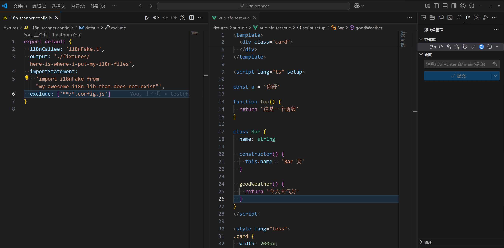

# i18n-scanner

一个用于 `.js|.jsx|.ts|.tsx|.vue` 文件国际化的命令行工具。

演示动图如下：



## 安装

```bash
npm i @hehe1111/i18n-scanner -g
```

## 使用

```bash
i18n scan -h
```

1. 命令行使用

```bash
i18n scan # 默认扫描当前目录
i18n scan <glob path>
i18n scan --ext .js,.jsx,.ts,.tsx
i18n scan <glob path> --output <输出文案文件>
```

2. 配置文件 i18n.config.js + 命令行

`i18n.config.js`

```js
export default {
  i18nCallee: 'i18nFake.t',
  output: './fixtures/here-is-where-i-put-my-i18n-files',
  importStatement: 'import i18nFake from "my-awesome-i18n-lib-that-does-not-exist"',
  exclude: ['**/*.config.js']
}
```

然后执行：

```bash
i18n scan <target_dir> -c <path/to/i18n.config.js>
```

注意：配置文件里的配置优先级高于命令行的参数配置

## LICENSE

MIT.
